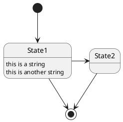

# PlantUML In-Place Preview

PlantUML In-Place Preview is a Google Chrome extension that renders PlantUML code blocks as diagrams in place.
It is a maintained fork of [Pegmatite](https://github.com/dai0304/pegmatite); the repository keeps the name `pegmatite` for continuity with the upstream project.

This fork adds GitBucket support and stronger GitLab support.
Rendering runs inside the browser instead of on a server.
No PlantUML server is contacted, so diagram source never leaves your machine.

[Chrome web store](https://chrome.google.com/webstore/detail/pegmatite-gitbucket/gkdjfofhecooaojkhbohidojebbpcene)

## Summary

| You will see below               | But we see
| -------------------------------- | -------------
|  | 

* This extension is enabled only in the whitelisted sites.
    * `https://github.com/*`
    * `https://gist.github.com/*`
    * `https://gitpitch.com/*`
    * `https://gitlab.com/*`
    * `https://bitbucket.org/*`
    * `https://*.backlog.jp/wiki/*`
    * `https://*/gitbucket/*`
    * `https://*/gitlab/*`
    * `http://*/gitbucket/*`
    * `http://*/gitlab/*`
* Replace only code block with lang `uml` and starts with `@start`.
    * lang `puml` or `plantuml` is also supported.
    * Depending on per-site profile, can enable auto-completion when `@startuml` is omitted.
* Hovering over the area shows two icons at its top right.
    * The first icon toggles between the original code block and the rendered diagram.
    * The second icon downloads the diagram as an SVG file, in either state.
        * The file is always rendered in the light theme, whatever the page theme is.
        * The file is named after `caption`, then `title`, then the `@start` parameter.
        * When the diagram has none of them, the file is numbered instead.

## Sample contents

### Sequence diagram with lang `uml`

```uml
@startuml
Alice -> Bob: Authentication Request
Bob --> Alice: Authentication Response

Alice -> Bob: Another authentication Request
Alice <-- Bob: another authentication Response
@enduml
```

### State diagram with lang `puml`



### Other code blocks

These cannot preview.

#### Code block without lang `uml`

```
@startuml
Foo -> Bar
@enduml
```

### `plantuml` code block does not starts with `@start`

```plantuml
Alice -> Bob: Authentication Request
Bob --> Alice: Authentication Response

Alice -> Bob: Another authentication Request
Alice <-- Bob: another authentication Response
```

#### `puml` code block does not starts with `@start` and syntax error

```puml
foo
bar
baz
```

## How rendering works

PlantUML In-Place Preview bundles the PlantUML JavaScript engine ([`@plantuml/core`](https://www.npmjs.com/package/@plantuml/core)).
This is the official PlantUML compiled to JavaScript with [TeaVM](https://github.com/konsoletyper/teavm).
Class, component, state, and activity diagrams need Graphviz layout.
That is provided by the bundled [Viz.js](https://github.com/mdaines/viz-js) WebAssembly build.

WebAssembly compilation requires the `wasm-unsafe-eval` content security policy.
That policy can only be granted to extension pages, so a content script cannot run the engine directly.
Instead the content script creates one hidden iframe pointing at the packaged `renderer.html`.
It sends the diagram source over `postMessage` and inserts the returned SVG into the page after sanitizing it.

The iframe is created only when a page actually contains a diagram, so pages without one never load the engine.

### Limitations compared with a PlantUML server

* Rendering capability is fixed to the bundled engine version.
* `!include` of remote files is not available.
* Clickable links written as `[[url]]` are not emitted by the JavaScript engine.
* Sudoku diagrams are absent, because `@plantuml/core` is built from the MIT-licensed flavor.

## Comparison with related projects

### Differences from the fork point (the original)

The fork point is [dai0304/pegmatite](https://github.com/dai0304/pegmatite) 1.6.0 (Pegmatite).
That version renders through a PlantUML server.

| Aspect | Original 1.6.0 | This fork 2.0.x
| ------ | -------------- | ---------------
| Rendering | PlantUML server over the network | Bundled engine, in the browser
| Diagram source leaves the machine | Yes | No
| Self-hosted GitBucket | Not supported | `*/gitbucket/*`, over HTTP too
| Self-hosted GitLab | Not supported | `*/gitlab/*`, over HTTP too
| GitLab 16+ code blocks | Not handled | Handled (`span.line`)
| Content added after page load | Not handled | Watched on GitHub and GitLab
| Settings | Base URL of the server | None needed
| Manifest | V2 | V3
| Permissions | `storage`, `tabs`, `https://*/*` | `scripting`, host permissions
| Package size | About 80 KB | About 8.2 MB (1.9 MB zipped)

### Differences from the official PlantUML for GitHub

[plantuml-for-github](https://github.com/plantuml/plantuml-for-github) is the PlantUML project's official extension.
It bundles the same TeaVM-compiled engine, so the diagrams themselves are identical.
The differences are in the sites covered and in how the result is placed on the page.

| Aspect | PlantUML for GitHub | PlantUML In-Place Preview
| ------ | ------------------- | -------------------------
| Sites | GitHub only | GitHub, GitLab, GitBucket, Bitbucket, Backlog
| Self-hosted instances | Not supported | GitBucket and GitLab, over HTTP too
| Fences detected | `plantuml`, `puml`, `wsd` | `uml`, `puml`, `plantuml`, and asciidoc blocks
| Diagram placement | One sandboxed iframe per diagram | Inline SVG, one hidden iframe per page
| Switching to source | Toggle button in a header bar | Icon shown on hover
| Taking the diagram out | Copy SVG and copy source buttons | Download as an SVG file
| Permissions | `clipboardWrite` only | `scripting`, host permissions
| Firefox | Supported | Out of scope
| License | MIT | Apache-2.0

If you only use github.com, the official extension asks for fewer permissions and is the simpler choice.
PlantUML In-Place Preview adds convenience for self-hosted GitBucket and GitLab.
The official extension does not support them.

## Building and testing locally

The `pegmatite` directory is loaded unpacked, but the rendering engine is fetched from npm rather than committed.
One command is therefore needed before the first load:

```sh
npm install
npm run vendor
```

This copies `plantuml.js` and `viz-global.js` into `pegmatite/vendor/`. Then:

1. Open `edge://extensions` in Microsoft Edge (or `chrome://extensions` in Google Chrome).
2. Enable **Developer mode**.
3. Click **Load unpacked**.
4. Select the `pegmatite` directory that contains `manifest.json`.
5. Open or reload a supported page containing a PlantUML code block.

After changing the source code, click **Reload** on the PlantUML In-Place Preview extension card and then reload the tab.
Confirm that:

* `uml`, `puml`, and `plantuml` code blocks are replaced with diagrams.
* Empty lines and indentation are preserved in the rendered diagram.
* Class or activity diagrams render, which confirms the WebAssembly layout engine works.
* Hovering over the area shows the icons, and the first one switches between code block and diagram.
* The second icon saves the diagram as an SVG file that opens correctly in a browser.
* The saved file is in the light theme, and is named after `caption` when the diagram has one.
* A diagram with no `caption`, `title`, or `@start` parameter is saved under a numbered name.
* The Network tab shows no request to `plantuml.com`.

If the extension does not run:

1. Check the PlantUML In-Place Preview extension card for errors.
2. Open the extension's **Service worker** link and inspect its DevTools console.
3. Inspect the page's DevTools console.
4. Confirm that the page URL matches one of the URL patterns in `pegmatite/manifest.json`.
5. Confirm that `pegmatite/vendor/` contains `plantuml.js` and `viz-global.js`.

## Privacy

PlantUML In-Place Preview reads PlantUML source from supported code blocks and renders it in the browser.
The source is not sent anywhere: there is no rendering server, and the extension stores no user data.
See [PRIVACY.md](PRIVACY.md) for details.

## Third-party software

PlantUML In-Place Preview itself is licensed under the Apache License 2.0.
The packaged extension additionally bundles two MIT-licensed components.
One is `@plantuml/core`, which is PlantUML by Arnaud Roques compiled to JavaScript.
The other is Viz.js by Michael Daines.
Its distribution contains Graphviz (Eclipse Public License 1.0) and Expat (MIT) in object code form.

Neither is committed to this repository.
Both are fetched from npm into `pegmatite/vendor/` by `npm run vendor` and retain their own license headers.
The release ZIP root also includes this product's LICENSE and NOTICE, the README, `LICENSE.plantuml-core` from `@plantuml/core`, and the license texts for Viz.js, Graphviz, and Expat (`LICENSE.viz-js`, `LICENSE.graphviz`, `LICENSE.expat`).
See [NOTICE](NOTICE) for the full attribution and the tagged upstream license URLs.

## Contribution

1. Fork ([https://github.com/dai0304/pegmatite/fork](https://github.com/dai0304/pegmatite/fork))
2. Create a feature branch named like `feature/something_awesome_feature` from `develop` branch
3. Commit your changes
4. Rebase your local changes against the `develop` branch
5. Create new Pull Request

## Author

[Daisuke Miyamoto](https://github.com/dai0304)

### Enhanced by

[Tetsuo Honda](https://github.com/hondarer)

## 日本語

PlantUML In-Place Preview は、PlantUML のコードブロックをその場で図として描画する Google Chrome の拡張機能です。
[Pegmatite](https://github.com/dai0304/pegmatite) のフォークを保守したもので、リポジトリ名 `pegmatite` はフォーク元との一貫性のため残しています。

このフォークは GitBucket 対応と GitLab 対応の強化を行い、描画をサーバーサイドではなくブラウザ内で行うようにしています。
PlantUML サーバへは接続しないため、図のソースが手元の環境から出ることはありません。

[Chrome ウェブストア](https://chrome.google.com/webstore/detail/pegmatite-gitbucket/gkdjfofhecooaojkhbohidojebbpcene)

### 概要

この拡張機能が動作するのは、許可リストに登録した次のサイトだけです。

* `https://github.com/*`
* `https://gist.github.com/*`
* `https://gitpitch.com/*`
* `https://gitlab.com/*`
* `https://bitbucket.org/*`
* `https://*.backlog.jp/wiki/*`
* `https://*/gitbucket/*`
* `https://*/gitlab/*`
* `http://*/gitbucket/*`
* `http://*/gitlab/*`

置き換えの対象は、言語指定が `uml` で、かつ `@start` で始まるコードブロックだけです。
言語指定は `puml` と `plantuml` にも対応します。サイトごとのプロファイルによっては、`@startuml` が省略されている場合に自動補完を有効にできます。

領域にホバーすると、右上にアイコンが 2 つ表示されます。
1 つ目のアイコンは、元のコードブロックと描画された図とを切り替えます。
2 つ目のアイコンは、どちらを表示していても、図を SVG ファイルとしてダウンロードします。
このファイルは、ページのテーマに関わらず常にライトテーマで描画します。
ファイル名には `caption`、`title`、`@start` のパラメータの順に採った名前を使います。
どれもない場合は連番を使います。

### サンプル

上の Sample contents 節を参照してください。シーケンス図とステート図の例に加えて、描画の対象にならないコードブロックの例も載せています。

### 描画の仕組み

PlantUML In-Place Preview は PlantUML の JavaScript 版エンジン ([`@plantuml/core`](https://www.npmjs.com/package/@plantuml/core)) を同梱しています。
これは PlantUML 本家を [TeaVM](https://github.com/konsoletyper/teavm) で JavaScript にコンパイルしたものです。
クラス図、コンポーネント図、ステート図、アクティビティ図には Graphviz のレイアウトが必要です。
これは同梱した [Viz.js](https://github.com/mdaines/viz-js) の WebAssembly 版が担います。

WebAssembly のコンパイルには `wasm-unsafe-eval` のコンテンツセキュリティポリシーが必要です。
これは拡張機能のページにしか付与できないため、content script からエンジンを直接実行することはできません。
代わりに content script が、拡張機能に同梱した `renderer.html` を指す不可視の iframe を 1 つ作ります。
そして図のソースを `postMessage` で送り、返ってきた SVG をサニタイズしたうえでページへ挿入します。

iframe を作るのは、ページに実際に図が含まれている場合だけです。
図のないページでエンジンが読み込まれることはありません。

#### PlantUML サーバと比べた場合の制約

* 描画できる範囲は、同梱したエンジンのバージョンに固定されます。
* リモートファイルの `!include` は使えません。
* `[[url]]` と書くクリック可能なリンクは、JavaScript 版エンジンでは出力されません。
* `@plantuml/core` が MIT ライセンス版のビルドであるため、Sudoku 図はありません。

### 関連プロジェクトとの違い

#### フォーク元 (オリジナル) との違い

フォーク元は [dai0304/pegmatite](https://github.com/dai0304/pegmatite) の 1.6.0 (Pegmatite) です。
このバージョンは、PlantUML サーバ経由で描画を行います。

| 項目 | オリジナル 1.6.0 | 本フォーク 2.0.x
| ---- | ---------------- | ----------------
| 描画方式 | ネットワーク越しの PlantUML サーバ | 同梱エンジンによるブラウザ内描画
| 図のソースの外部送信 | あり | なし
| 自ホストの GitBucket | 非対応 | `*/gitbucket/*`、HTTP も可
| 自ホストの GitLab | 非対応 | `*/gitlab/*`、HTTP も可
| GitLab 16 以降のコードブロック | 未対応 | 対応済み (`span.line`)
| 読み込み後に追加される本文 | 未対応 | GitHub と GitLab で監視
| 設定項目 | サーバの Base URL | 不要
| Manifest | V2 | V3
| 権限 | `storage`、`tabs`、`https://*/*` | `scripting`、ホスト権限
| 配布サイズ | 約 80KB | 約 8.2MB (ZIP で 1.9MB)

#### 公式の PlantUML for GitHub との違い

[plantuml-for-github](https://github.com/plantuml/plantuml-for-github) は PlantUML プロジェクト公式の拡張機能です。
TeaVM でコンパイルした同じエンジンを同梱しているため、描画される図そのものは同一です。
違いは対応範囲と、結果をページへ置く方法です。

| 項目 | PlantUML for GitHub | PlantUML In-Place Preview
| ---- | ------------------- | -------------------------
| 対応サイト | GitHub のみ | GitHub、GitLab、GitBucket、Bitbucket、Backlog
| 自ホストのインスタンス | 非対応 | GitBucket と GitLab、HTTP も可
| 検出する言語指定 | `plantuml`、`puml`、`wsd` | `uml`、`puml`、`plantuml`、asciidoc
| 図の配置 | 図ごとに sandbox iframe | インライン SVG、iframe はページに 1 つ
| ソースへの切り替え | ヘッダのトグルボタン | ホバーで出るアイコン
| 図の持ち出し | SVG とソースのコピーボタン | SVG ファイルのダウンロード
| 権限 | `clipboardWrite` のみ | `scripting`、ホスト権限
| Firefox | 対応 | 対象外
| ライセンス | MIT | Apache-2.0

github.com しか利用しないのであれば、公式の拡張機能のほうが要求する権限が少なく簡潔です。
PlantUML In-Place Preview は、公式ではサポートされない自ホストの GitBucket と GitLab に対する利便性を提供します。

### ビルドとローカルでの動作確認

`pegmatite` ディレクトリはパッケージ化せずに読み込みますが、描画エンジンはリポジトリにコミットせず npm から取得するため、最初に読み込む前に次のコマンドが必要です。

```sh
npm install
npm run vendor
```

これで `plantuml.js` と `viz-global.js` が `pegmatite/vendor/` へコピーされます。続いて次の手順を実行します。

1. Microsoft Edge で `edge://extensions` を開きます (Google Chrome の場合は `chrome://extensions`)。
2. 開発者モードを有効にします。
3. パッケージ化されていない拡張機能を読み込む をクリックします。
4. `manifest.json` を含む `pegmatite` ディレクトリを選択します。
5. PlantUML のコードブロックを含む対応ページを開くか、再読み込みします。

ソースコードを変更したあとは、PlantUML In-Place Preview の拡張機能カードで 再読み込み をクリックし、続いてタブを再読み込みしてください。
そのうえで次の点を確認します。

* `uml`、`puml`、`plantuml` のコードブロックが図に置き換わること。
* 描画された図で空行とインデントが保たれていること。
* クラス図やアクティビティ図が描画されること。WebAssembly のレイアウトエンジンが動作している証拠になります。
* 領域にホバーするとアイコンが表示され、1 つ目のアイコンで元のコードブロックと図が切り替わること。
* 2 つ目のアイコンで SVG ファイルが保存され、そのファイルがブラウザで正しく開けること。
* 保存したファイルがライトテーマであり、`caption` があればその文字列がファイル名になること。
* `caption`、`title`、`@start` のパラメータのいずれもない図は、連番の名前で保存されること。
* ネットワークタブに `plantuml.com` へのリクエストが出ないこと。

拡張機能が動作しない場合は、次の順に確認してください。

1. PlantUML In-Place Preview の拡張機能カードにエラーが出ていないか確認します。
2. 拡張機能の Service worker のリンクを開き、その DevTools のコンソールを確認します。
3. ページの DevTools のコンソールを確認します。
4. ページの URL が `pegmatite/manifest.json` の URL パターンのいずれかに一致するか確認します。
5. `pegmatite/vendor/` に `plantuml.js` と `viz-global.js` があるか確認します。

### プライバシー

PlantUML In-Place Preview は、対応するコードブロックから PlantUML のソースを読み取り、ブラウザ内で描画します。
ソースはどこにも送信しません。
描画サーバは存在せず、拡張機能が利用者のデータを保存することもありません。
詳細は [PRIVACY.md](PRIVACY.md) を参照してください。

### 第三者ソフトウェア

PlantUML In-Place Preview 自体は Apache License 2.0 のもとで提供されます。
パッケージ化した拡張機能には、これに加えて MIT ライセンスの 2 つのコンポーネントを同梱しています。
1 つは Arnaud Roques 氏による PlantUML を JavaScript にコンパイルした `@plantuml/core` です。
もう 1 つは Michael Daines 氏による Viz.js です。
その配布物には、オブジェクトコードの形で Graphviz (Eclipse Public License 1.0) と Expat (MIT) が含まれます。

どちらもこのリポジトリにはコミットしていません。
いずれも `npm run vendor` によって npm から `pegmatite/vendor/` へ取得され、それぞれのライセンスヘッダを保持しています。
リリース ZIP のルートには、本製品の LICENSE と NOTICE、README、`@plantuml/core` 由来の `LICENSE.plantuml-core`、および Viz.js / Graphviz / Expat のライセンス全文 (`LICENSE.viz-js`、`LICENSE.graphviz`、`LICENSE.expat`) も入ります。
帰属表示の全文と、上流のタグ付き LICENSE URL は [NOTICE](NOTICE) を参照してください。

### 貢献

1. フォークします ([https://github.com/dai0304/pegmatite/fork](https://github.com/dai0304/pegmatite/fork))
2. `develop` ブランチから `feature/something_awesome_feature` のような名前で機能ブランチを作ります
3. 変更をコミットします
4. ローカルの変更を `develop` ブランチにリベースします
5. プルリクエストを作成します

### 作者

[Daisuke Miyamoto](https://github.com/dai0304)

#### 機能追加

[Tetsuo Honda](https://github.com/hondarer)
