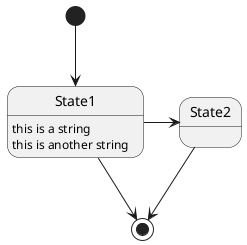

# Pegmatite-gitbucket - Chrome ext to preview PlantUML in markdown

Pegmatite is Google Chrome extension that replace PlantUML code blocks into preview images.

This version is the original Pegmatite with enhanced GitBucket support.

[Chrome web store](https://chrome.google.com/webstore/detail/pegmatite-gitbucket/gkdjfofhecooaojkhbohidojebbpcene)

## Summary

| You will see below               | But we see
| -------------------------------- | -------------
|  | 

* This extension is enabled only in the whitelisted sites.
    * `https://github.com/*`
    * `https://gist.github.com/*`
    * `https://gitpitch.com/*`
    * `https://gitlab.com/*`
    * `https://bitbucket.org/*`
    * `https://*.backlog.jp/wiki/*`
    * `https://*/gitbucket/*`
    * `https://*/gitlab/*`
    * `http://*/gitbucket/*`
    * `http://*/gitlab/*`
* Replace only code block with lang `uml` and starts with `@start`.
    * lang `puml` or `plantuml` is also supported.
    * Depending on per-site profile, can enable auto-completion when `@startuml` is omitted.
* When the element is double-clicked, element will toggle original code block and preview image.

## Sample contents

### Sequence diagram with lang `uml`

```uml
@startuml
Alice -> Bob: Authentication Request
Bob --> Alice: Authentication Response

Alice -> Bob: Another authentication Request
Alice <-- Bob: another authentication Response
@enduml
```

### State diagram with lang `puml`



### Other code blocks

These cannot preview.

#### Code block without lang `uml`

```
@startuml
Foo -> Bar
@enduml
```

### `plantuml` code block does not starts with `@start`

```plantuml
Alice -> Bob: Authentication Request
Bob --> Alice: Authentication Response

Alice -> Bob: Another authentication Request
Alice <-- Bob: another authentication Response
```

#### `puml` code block does not starts with `@start` and syntax error

```puml
foo
bar
baz
```

## Using another PlantUML server

By default, Pegmatite uses [PlantUML server](https://github.com/plantuml/plantuml-server)
deployed to `https://www.plantuml.com/plantuml`.

However, if your UML is confidential and you cannot send it to an external server, you can also use any PlantUML server.
Configuring "Base URL" on the setting page, Pegmatite delegates image generation to this server.

Examples.

* `https://www.plantuml.com/plantuml/img/` (default)
* `https://www.plantuml.com/plantuml/svg/`
* `https://any-plantuml-server.example.com:8080/img/`

## Running a local PlantUML server (for confidential diagrams)

If your UML diagrams contain sensitive or confidential information, you can run a PlantUML server locally so that diagram source is never sent to an external host.

### Option 1: Docker

```
docker run -d -p 8080:8080 plantuml/plantuml-server
```

Set *Base URL* to:

```
http://localhost:8080/img/
```

### Option 2: Java + plantuml.jar

If you have Java installed, download `plantuml.jar` from the [PlantUML releases page](https://github.com/plantuml/plantuml/releases) and start the built-in web server with the `-picoweb` option:

```
java -jar plantuml.jar -picoweb:8080
```

Set *Base URL* to:

```
http://localhost:8080/plantuml/img/
```

### Configuring Pegmatite to use the local server

1. Click the Pegmatite extension icon in the Chrome toolbar and open **Options**.
2. Enter the *Base URL* shown above for your chosen method.
3. Click **Save**.

Pegmatite will now render all diagrams using your local server without any external network requests.

> **Note:** To avoid mixed-content errors, when *Base URL* is HTTP (not HTTPS), the generated image is automatically converted to a [DATA URI](https://tools.ietf.org/html/rfc2397) internally.

## Contribution

1. Fork ([https://github.com/dai0304/pegmatite/fork](https://github.com/dai0304/pegmatite/fork))
2. Create a feature branch named like `feature/something_awesome_feature` from `develop` branch
3. Commit your changes
4. Rebase your local changes against the `develop` branch
5. Create new Pull Request

## Author

[Daisuke Miyamoto](https://github.com/dai0304)

### Enhanced by

[Tetsuo Honda](https://github.com/hondarer)
